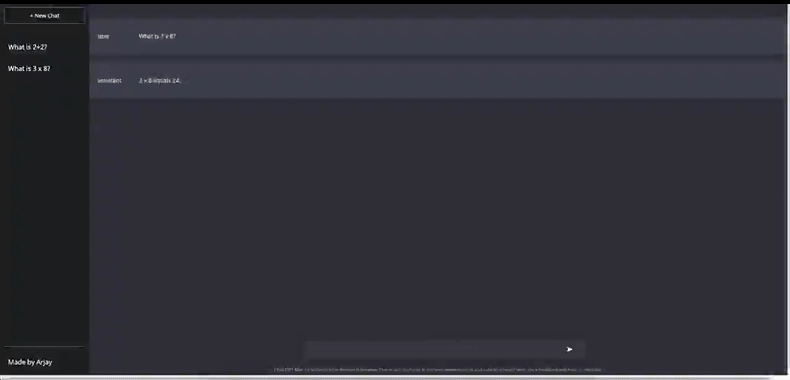

 

# **ArjayGPT** 

### A personal project ChatGPT clone  

## **Screenshots**
 

## Author

- [@arjybltrn](https://www.github.com/arjybltrn)

---

## Stay in touch
[![LinkedIn][linkedin-img]][linkedin-url] 
[![GitHub][github-img]][github-url] 

    <a href="#top">🔝</a>

<!-- markdown links and images-->

[hello]: https://img.shields.io/badge/react-8A2BE2
[html-img]: https://img.shields.io/badge/HTML-239120?style=for-the-badge&logo=html5&logoColor=white
[css-img]: https://img.shields.io/badge/CSS3-1572B6?style=for-the-badge&logo=css3&logoColor=white
[js-img]: https://img.shields.io/badge/JavaScript-323330?style=for-the-badge&logo=javascript&logoColor=F7DF1E
[google-fonts-img]: https://img.shields.io/badge/%20-Google%20Fonts-blue
[jquery-img]: https://img.shields.io/badge/%20-jQuery-success
[github-img]: https://img.shields.io/badge/GitHub-100000?style=for-the-badge&logo=github&logoColor=white
[linkedin-img]: https://img.shields.io/badge/LinkedIn-0077B5?style=for-the-badge&logo=linkedin&logoColor=white
[nodejs-img]: https://img.shields.io/badge/Node.js-43853D?style=for-the-badge&logo=node.js&logoColor=white
[mongodb-img]: https://img.shields.io/badge/MongoDB-4EA94B?style=for-the-badge&logo=mongodb&logoColor=white
[heroku-img]: https://img.shields.io/badge/Heroku-430098?style=for-the-badge&logo=heroku&logoColor=white
[trello-img]: https://img.shields.io/badge/Trello-0052CC?style=for-the-badge&logo=trello&logoColor=white
[github-stats]: https://github-readme-stats.vercel.app/api/top-langs/?username=arjybltrn&theme=blue-green
[npm-v]: https://img.shields.io/badge/npm-v9.6.2-blue
[mac-mini]: https://img.shields.io/badge/Apple-Mac%20Mini-lightgrey
[slack-img]: https://img.shields.io/badge/Slack-4A154B?style=for-the-badge&logo=slack&logoColor=white
[dotenv-img]: https://img.shields.io/badge/dotenv-%5Ev16.0.3-orange
[ejs-img]: https://img.shields.io/badge/express-%5Ev4.18.2-yellow
[mongoose-img]: https://img.shields.io/badge/mongoose-%5Ev7.0.3-red
[expressjs-img]: https://img.shields.io/badge/EJS-404D59?style=for-the-badge
<!-- URLs -->

[html-url]: https://developer.mozilla.org/en-US/docs/Glossary/HTML5
[css-url]: https://developer.mozilla.org/en-US/docs/Web/CSS
[js-url]: https://developer.mozilla.org/en-US/docs/Web/JavaScript
[google-fonts-url]: https://fonts.google.com/
[jquery-url]: https://jquery.com/
[linkedin-url]: https://www.linkedin.com/in/arjaybeltran/
[github-url]: https://github.com/Arjybltrn
[mongodb-url]: https://www.mongodb.com/
[heroku-url]: https://docket-project-two.herokuapp.com/
[trello-url]: https://trello.com/b/TG3TXxyV/docket-crud-app
[nodejs-url]: https://nodejs.org/en
[slack-url]: U04RP3Z84RE
[expressjs-url]: https://expressjs.com/